# Voice to Value — Product Strategy

> *Empowering every farmer to grow wealth with just their voice.*

---

## 1. Refined Vision & Value Proposition

### The Problem (Root Causes)

| Barrier | Impact |
|---|---|
| **No credit history** | 1.7B adults globally are unbanked; farmers can't prove creditworthiness |
| **Literacy walls** | ~770M illiterate adults worldwide; app-based fintech excludes them |
| **Language exclusion** | Most ag-tech supports only English/French — not Hausa, Yoruba, Igbo, Twi, Swahili, etc. |
| **Collateral requirements** | Smallholders own <2 ha; traditional banks reject them |
| **Disability gaps** | Visually impaired, amputee, and mobility-limited farmers have zero accessible tools |
| **Information asymmetry** | Farmers plant at wrong times, over-irrigate, and lose 30–40% of yields |

### Refined Value Proposition

> **Voice to Value** turns a farmer's voice into a financial identity — building real-time, blockchain-verified credit scores from farming behavior, enabling zero-collateral microloans, and delivering prescriptive agronomic guidance — all through voice, in any local language, online or offline.

### What Makes This Different (Competitive Moat)

**Key differentiators vs. competitors (FarmCrowdy, Apollo Agriculture, Digifarm):**

1. **Voice-native, not voice-added** — built ground-up for zero-literacy users
2. **Self-sovereign credit identity** — farmers own their data on-chain, portable across lenders
3. **Prescriptive, not just descriptive** — tells farmers *what to do and when*, not just weather data
4. **Disability-inclusive by design** — haptic feedback, audio-spatial UI, switch-access support
5. **Offline-first architecture** — works with no connectivity, syncs opportunistically

---

## 2. Target User Personas

### Persona 1: Amina (Smallholder, Low-Literacy)
- **Location:** Kano, Nigeria · **Crop:** Millet & Cowpea · **Land:** 1.2 ha
- **Pain:** Cannot read SMS-based farm advisories; rejected by all banks
- **Need:** Voice-based credit access in Hausa; planting calendar alerts
- **Device:** Feature phone (KaiOS) shared with husband

### Persona 2: Kofi (Visually Impaired Farmer)
- **Location:** Ashanti Region, Ghana · **Crop:** Cocoa · **Land:** 0.8 ha
- **Pain:** Every fintech requires visual interaction; no screen readers in Twi
- **Need:** Fully audio-navigable loan application; haptic confirmations
- **Device:** Basic Android smartphone (donated by NGO)

### Persona 3: Maria (Cooperative Leader)
- **Location:** Oyo State, Nigeria · **Role:** Manages 45-member women's cooperative
- **Pain:** No way to aggregate group credit; paper records lost in floods
- **Need:** Group credit scoring; voice-based bookkeeping; SMS receipts
- **Device:** Android phone with intermittent 3G

---

## 3. Scalable Business Models

### Revenue Architecture (Blended Model)

| Stream | Mechanism | Year 1 Target |
|---|---|---|
| **Loan facilitation fees** | 2–3% fee on each disbursed microloan (paid by lending partner) | $120K |
| **Premium advisory (B2B2C)** | Agribusinesses pay to push crop-specific guidance to farmers | $80K |
| **Data insights (anonymized)** | Sell aggregated crop/soil/yield data to insurers, govts, commodity traders | $60K |
| **SaaS for MFIs** | White-label voice-credit platform licensed to microfinance institutions | $150K |
| **Carbon credit facilitation** | Help farmers monetize climate-smart practices via voluntary carbon markets | $40K |

### Unit Economics Target

| Metric | Target |
|---|---|
| Customer Acquisition Cost (CAC) | < $2 per farmer (via cooperatives & community agents) |
| Average Loan Size | $50–$500 |
| Platform Take Rate | 2.5% |
| Gross Margin on SaaS | 70%+ |
| Payback Period | < 6 months per farmer cohort |

### Path to Sustainability

---

## 4. System Architecture (Simplified)

```mermaid
flowchart TD
    subgraph "Farmer Layer"
        V["🎙️ Voice Interface<br/>USSD / KaiOS / Android"]
        O["📴 Offline Engine<br/>Local-first data store"]
    end

    subgraph "Intelligence Layer"
        ASR["Speech-to-Text<br/>(Whisper fine-tuned<br/>on local languages)"]
        NLU["Intent Engine<br/>(Rasa / Dialogflow)"]
        TTS["Text-to-Speech<br/>(Coqui TTS)"]
        FARM["Farm AI<br/>(Planting, irrigation,<br/>harvest prescriptions)"]
    end

    subgraph "Finance Layer"
        CS["Credit Scoring Engine<br/>(ML on farm behavior)"]
        BC["Blockchain Ledger<br/>(Hyperledger Fabric)"]
        LP["Lending Partners API"]
        MW["Mobile Wallet Integration<br/>(M-Pesa, OPay, MTN MoMo)"]
    end

    subgraph "Data Layer"
        SAT["Satellite & Weather<br/>(Sentinel-2, CHIRPS)"]
        IOT["IoT / SMS Sensors"]
    end

    V --> ASR --> NLU
    NLU --> CS
    NLU --> FARM
    NLU --> TTS --> V
    O <--> V
    CS <--> BC
    CS --> LP --> MW
    FARM --> SAT
    FARM --> IOT
```

### Key Tech Decisions

| Decision | Rationale |
|---|---|
| **USSD as primary channel** | Works on any phone, zero data cost, 100% offline-capable |
| **Hyperledger Fabric (not Ethereum)** | Permissioned chain = lower cost, faster, better for regulated finance |
| **Whisper fine-tuned locally** | OpenAI Whisper has best base for low-resource language adaptation |
| **Offline-first sync** | CRDTs (conflict-free replicated data types) for eventual consistency |
| **KaiOS app** | 120M+ KaiOS devices in Africa; bridges feature-phone to smartphone gap |

---

## 5. Risk Analysis & Mitigation

| # | Risk | Severity | Likelihood | Mitigation |
|---|---|---|---|---|
| 1 | **Low voice recognition accuracy** in noisy farm environments | 🔴 High | Medium | Noise-canceling preprocessing; keyword-spotting fallback; USSD text backup |
| 2 | **Loan default rates** exceed sustainable levels | 🔴 High | Medium | Start with tiny loans ($10–$50); social collateral via cooperatives; graduated trust |
| 3 | **Data privacy / misuse** of farmer voice & financial data | 🔴 High | Low | On-device processing where possible; data sovereignty policy; farmer consent flows in voice |
| 4 | **Regulatory barriers** (lending licenses, blockchain compliance) | 🟡 Medium | High | Partner with licensed MFIs (don't lend directly); regulatory sandbox applications |
| 5 | **Low adoption** due to trust deficit | 🟡 Medium | Medium | Community agent model; chief/elder endorsement; demo-before-signup at markets |
| 6 | **Language model gaps** for rare dialects | 🟡 Medium | High | Crowd-source voice data from communities; pay contributors; start with top-5 languages |
| 7 | **Climate shocks** destroy crops before loan repayment | 🔴 High | Medium | Bundle micro-insurance with loans; weather-indexed automatic payouts |
| 8 | **Gender digital divide** — women can't access shared devices freely | 🟡 Medium | High | Voiceprint-based private profiles; women-only cooperative features; evening access hours |

---

## 6. Partnerships & Go-to-Market

### Strategic Partners

| Partner Type | Examples | Value Exchange |
|---|---|---|
| **Telecom (USSD/data)** | MTN, Airtel, Glo | Zero-rated USSD access; farmer base for mobile money |
| **Microfinance** | LAPO, Accion, Kiva | Lending capital; we provide credit scoring + distribution |
| **Agri-input companies** | Syngenta, IITA, notore | Subsidized inputs as loan-in-kind; farmer engagement channel |
| **Govt agencies** | CBN (Nigeria), BoG (Ghana) | Regulatory cover; anchor farmer registry data |
| **Satellite/weather** | ESA Sentinel, aWhere | Free/subsidized satellite imagery + weather data |
| **Disability orgs** | CBM International, Leonard Cheshire | Accessibility audits; reach disabled farming communities |
| **Mobile money** | M-Pesa, OPay, MTN MoMo | Disbursement & repayment rails |

### Go-to-Market Strategy (3 Phases)

**Phase 1 — Seed & Prove (Months 0–12)**
- 🎯 **Geography:** 3 LGAs in Kano State, Nigeria (millet/cowpea belt)
- 📣 **Channel:** Community agents (1 agent per 200 farmers) recruited from cooperatives
- 💰 **Offer:** Free credit score + first loan ($20 avg) with zero collateral
- 📊 **Success Metric:** 2,000 farmers onboarded, >85% repayment rate, NPS >60

**Phase 2 — Expand & Monetize (Months 12–24)**
- 🎯 **Geography:** Expand to Oyo, Kaduna (Nigeria) + Ashanti (Ghana)
- 📣 **Channel:** MFI partnerships + telecom bundles (MTN zero-rated USSD)
- 💰 **Offer:** SaaS licensing to 3+ MFIs; launch premium advisory tier
- 📊 **Success Metric:** 20,000 farmers, 3 MFI partners, $400K ARR

**Phase 3 — Scale & Diversify (Months 24–36)**
- 🎯 **Geography:** East Africa (Kenya, Tanzania) + francophone West Africa
- 📣 **Channel:** Govt integration (national farmer registries) + B2B data sales
- 💰 **Offer:** Carbon credit facilitation; crop insurance bundling
- 📊 **Success Metric:** 100,000+ farmers, 5-country presence, $1.5M ARR

---

## 7. Accessibility-First Design Principles

| Principle | Implementation |
|---|---|
| **Audio-spatial navigation** | Menu items mapped to directional gestures (swipe left/right = navigate; double-tap = select) |
| **Voiceprint identity** | No passwords; farmer's voice IS their login — with liveness detection |
| **Haptic confirmations** | Vibration patterns confirm actions (1 buzz = success, 3 = error) |
| **Adaptive speech rate** | System detects and matches the farmer's speaking pace |
| **USSD fallback** | Full functionality via USSD for users with no smartphone |
| **Switch access** | Physical button navigation for farmers with limited hand mobility |
| **High-contrast audio mode** | Key financial info (loan amount, due date) repeated and confirmed before proceeding |

---

## 8. Credit Scoring Model (Behavioral)

> [!IMPORTANT]
> No traditional credit bureau data is used. The score is built entirely from observable farming behavior.

| Signal | Weight | Source |
|---|---|---|
| **Planting timing compliance** | 20% | Did the farmer plant within the recommended window? (satellite + self-report) |
| **Input purchase history** | 15% | Tracked via mobile money transactions with agro-dealers |
| **Harvest yield estimates** | 15% | Satellite NDVI + self-reported voice logs |
| **Cooperative membership & standing** | 15% | Verified by cooperative leader via voice attestation |
| **Loan repayment history** | 20% | On-chain repayment records (grows over time) |
| **Community trust score** | 10% | Peer endorsements (3 farmers vouch via voice) |
| **Platform engagement** | 5% | Frequency of advisory usage, weather checks, etc. |

---

## 9. Design Competition Optimization

### Judging Criteria Alignment

| Typical Criterion | How Voice to Value Scores |
|---|---|
| **Innovation** | Voice-native credit identity on blockchain — no comparable product exists at this intersection |
| **Impact** | Quantifiable: # farmers, $ lent, yield % increase, time saved |
| **Feasibility** | USSD works today on every phone; no new hardware needed |
| **Scalability** | Language packs + MFI SaaS model = country-agnostic |
| **Inclusivity** | Explicitly designed for disabled, low-literacy, and women farmers |
| **Sustainability** | 5 revenue streams; not grant-dependent after Year 1 |

### Pitch Framing (60-Second Story)

> *"Amina grows millet in Kano. She's never been inside a bank. She can't read. But she knows her land better than anyone. Voice to Value lets Amina speak into her phone in Hausa, builds her a credit score from how she farms, and gives her a $50 loan — no collateral, no paperwork, no bank visit. Last season, she followed the platform's planting advice and her yield went up 30%. She repaid the loan from her harvest. This season, she's eligible for $150. That's Voice to Value: turning a farmer's voice into financial power."*

### Demo Strategy

1. **Live voice demo** — show a Hausa voice interaction on a feature phone
2. **Before/after data** — yield and income comparison for pilot farmers
3. **Blockchain receipt** — show the immutable credit record
4. **Accessibility showcase** — demonstrate the visually-impaired user flow
5. **Offline proof** — turn off Wi-Fi, show the system still works

---

## 10. Impact Measurement Framework

| Metric | Baseline | Year 1 Target | Tool |
|---|---|---|---|
| Farmers with formal credit score | 0% | 80% of users | Platform data |
| Avg. income change | — | +25% | Surveys + mobile money data |
| Yield improvement | — | +20% | Satellite NDVI comparison |
| Loan repayment rate | — | >85% | On-chain data |
| Women users | — | >40% | Platform data |
| Disabled users | — | >5% | Platform data |
| Time to loan disbursement | Days/weeks | <24 hours | Platform data |

---

## 11. Competitive Landscape

| Feature | Voice to Value | Apollo Ag | FarmCrowdy | Digifarm |
|---|---|---|---|---|
| Voice-first interface | ✅ | ❌ | ❌ | ❌ |
| Works on feature phones | ✅ (USSD) | ❌ | ❌ | ✅ (USSD) |
| Blockchain credit | ✅ | ❌ | ❌ | ❌ |
| Zero-collateral loans | ✅ | Partial | ❌ | Partial |
| Disability accessible | ✅ | ❌ | ❌ | ❌ |
| Prescriptive farm AI | ✅ | ✅ | ❌ | Partial |
| Offline mode | ✅ | ❌ | ❌ | ❌ |
| Local language support (5+) | ✅ | ❌ | ❌ | ✅ |

---

> [!TIP]
> **Next Steps:** This strategy document should be paired with a clickable prototype (USSD simulator + voice demo) and a 2-page executive summary for investor/competition submissions.
