# Voice to Value — User Journey Map

> End-to-end journeys for three personas: Amina (smallholder, low-literacy), Kofi (visually impaired), and Maria (cooperative leader).

---

## 1. Journey Overview

---

## 2. Persona 1: Amina (Smallholder, Low-Literacy, Hausa)

**Profile:** Female, 38, Kano State, Nigeria. Grows millet & cowpea on 1.2 ha. Cannot read/write. Uses a shared KaiOS feature phone.

### Full Journey

```mermaid
flowchart TD
    subgraph "🔊 AWARENESS"
        A1["Hears about Voice to Value\nfrom cooperative leader\nat weekly meeting"]
        A2["Community agent does\nlive demo at local market"]
        A3["Amina watches a neighbor\nreceive a loan via voice"]
    end

    subgraph "📞 ONBOARDING"
        B1["Dials *347*88# on\nhusband's KaiOS phone"]
        B2["Selects '2' for Hausa\nhears welcome in her language"]
        B3["Says her name into phone\nvoiceprint captured as login"]
        B4["Agent helps enter farm\ndetails: crop, land size, location"]
    end

    subgraph "📊 CREDIT SCORE"
        C1["System checks:\n- Cooperative membership ✅\n- Planting season compliance ✅\n- Peer endorsements (3 required)"]
        C2["3 cooperative members\nvouch for Amina via voice call"]
        C3["Credit score calculated: 680\nSpoken to her in Hausa"]
    end

    subgraph "💰 FIRST LOAN"
        D1["Qualifies for ₦30,000\n(~$20 USD) first loan"]
        D2["Loan terms spoken:\n5% flat, 6 months, ₦5,250/mo"]
        D3["Amina says 'Na amince'\n(I agree) — voice confirmation"]
        D4["₦30,000 sent to\nher OPay mobile wallet"]
        D5["Blockchain TX recorded\nSMS receipt sent"]
    end

    subgraph "🌱 FARM ADVISORY"
        E1["Week 2: Voice alert\n'Plant millet in 3 days,\nrain expected'"]
        E2["Week 6: 'Irrigate cowpea,\nsoil moisture is low'"]
        E3["Week 14: 'Harvest in\n5 days — dry spell coming'"]
        E4["Amina follows advice\nyield increases 30%"]
    end

    subgraph "💳 REPAYMENT"
        F1["Monthly voice reminder:\n'Your payment of ₦5,250\nis due in 3 days'"]
        F2["Pays via OPay mobile money\nat local agent point"]
        F3["On-chain record updated\ncredit score rises to 720"]
    end

    subgraph "🔄 RE-ENGAGEMENT"
        G1["Next season: qualifies\nfor ₦75,000 loan"]
        G2["Refers 4 neighbors\nearns referral bonus"]
        G3["Selected as community\nagent (₦15K/month)"]
    end

    A1 --> A2 --> A3 --> B1
    B1 --> B2 --> B3 --> B4
    B4 --> C1 --> C2 --> C3
    C3 --> D1 --> D2 --> D3 --> D4 --> D5
    D5 --> E1 --> E2 --> E3 --> E4
    E4 --> F1 --> F2 --> F3
    F3 --> G1 --> G2 --> G3
```

### Emotional Journey

| Stage | Emotion | Trigger |
|---|---|---|
| Awareness | Curiosity + Skepticism | "Is this real? Banks always reject me" |
| Onboarding | Surprise + Delight | "It speaks Hausa! I don't need to read!" |
| Credit Score | Pride | "I have a score — I'm financially visible" |
| First Loan | Joy + Anxiety | "The money arrived! But can I repay?" |
| Farm Advisory | Trust + Confidence | "The planting advice was right — my crops are better" |
| Repayment | Relief + Accomplishment | "I paid it all back. I am creditworthy" |
| Re-engagement | Empowerment | "I'm helping my neighbors access loans too" |

### Key Touchpoints

| Touchpoint | Channel | Accessibility |
|---|---|---|
| Market demo | In-person (community agent) | Visual + verbal |
| USSD dial-in | *347*88# (any phone) | Keypad + voice |
| Voice registration | USSD + ASR | Voice only — zero reading |
| Loan confirmation | Voice + SMS receipt | Dual-channel backup |
| Farm alerts | Voice call + USSD push | Proactive, scheduled |
| Repayment | OPay agent point | Cash or mobile money |
| Blockchain ID | USSD query | Voice readout of record |

---

## 3. Persona 2: Kofi (Visually Impaired Farmer, Twi/English)

**Profile:** Male, 45, Ashanti Region, Ghana. Grows cocoa on 0.8 ha. Visually impaired since age 12. Uses a basic Android phone donated by an NGO.

### Full Journey

```mermaid
flowchart TD
    subgraph "🔊 AWARENESS"
        KA1["CBM disability\nfield officer introduces\nVoice to Value"]
        KA2["Kofi tries the app\nat CBM center —\nfully audio-guided"]
    end

    subgraph "📞 ONBOARDING"
        KB1["Opens Android app\nscreen reader announces:\n'Welcome to Voice to Value'"]
        KB2["Entire flow is\naudio-spatial: swipe to\nnavigate, double-tap to select"]
        KB3["Voiceprint registration\nNo passwords needed"]
        KB4["Haptic confirmation:\n1 vibration = success\n3 vibrations = try again"]
    end

    subgraph "📊 CREDIT SCORE"
        KC1["Score based on:\ncocoa yield history,\ncooperative standing,\npeer endorsements"]
        KC2["Score: 650\nSpoken: 'Your credit\nscore is six hundred\nand fifty — Fair standing'"]
    end

    subgraph "💰 FIRST LOAN"
        KD1["Qualifies for GH₵ 800\n(~$55 USD)"]
        KD2["Loan terms spoken slowly\nwith pause for comprehension"]
        KD3["Voice confirmation:\n'Say YES to accept'"]
        KD4["Haptic: 2 long vibrations\n= money sent successfully"]
        KD5["Audio receipt: TX hash,\namount, due date all spoken"]
    end

    subgraph "🌱 ADVISORY"
        KE1["Weekly cocoa care alerts\nin English/Twi"]
        KE2["'Prune cocoa trees\nthis week for better\npod development'"]
        KE3["Pest alert: 'Black pod\ndisease risk is HIGH.\nApply fungicide within 48 hrs'"]
    end

    subgraph "💳 REPAYMENT"
        KF1["MTN MoMo auto-debit\nset up via voice"]
        KF2["Monthly audio statement:\n'You have paid 3 of 6\ninstallments. Remaining: GH₵ 420'"]
    end

    KA1 --> KA2 --> KB1
    KB1 --> KB2 --> KB3 --> KB4
    KB4 --> KC1 --> KC2
    KC2 --> KD1 --> KD2 --> KD3 --> KD4 --> KD5
    KD5 --> KE1 --> KE2 --> KE3
    KE3 --> KF1 --> KF2
```

### Accessibility Features Used

| Feature | How Kofi Uses It |
|---|---|
| **Audio-spatial navigation** | Swipe left/right to move between menu items; hears position ("Item 2 of 5") |
| **Voiceprint login** | No passwords or PINs — his voice is his identity |
| **Haptic patterns** | 1 short = success, 2 long = money sent, 3 short = error |
| **Speed control** | System adapts speech rate to Kofi's preferred pace |
| **Audio receipts** | All financial details are spoken, not just displayed |
| **Switch access** | Can use a single physical button if touchscreen is difficult |

---

## 4. Persona 3: Maria (Cooperative Leader, Yoruba/English)

**Profile:** Female, 52, Oyo State, Nigeria. Manages a 45-member women's farming cooperative. Literate. Uses Android smartphone with intermittent 3G.

### Full Journey

```mermaid
flowchart TD
    subgraph "🔊 AWARENESS"
        MA1["MFI partner presents\nVoice to Value at\ncooperative annual meeting"]
        MA2["Maria recognizes value\nfor her members who\ncannot read"]
    end

    subgraph "📞 ONBOARDING"
        MB1["Maria registers as\n'Cooperative Leader'\nwith admin privileges"]
        MB2["Bulk-registers 45 members\nvia voice enrollment sessions"]
        MB3["Each member records\nvoiceprint + farm details"]
    end

    subgraph "📊 GROUP CREDIT"
        MC1["Individual scores generated\nfor all 45 members"]
        MC2["Group average: 710\nUnlocks group loan facility"]
        MC3["Maria views dashboard:\nmembers ranked by score"]
    end

    subgraph "💰 GROUP LOAN"
        MD1["Group qualifies for\n₦2,250,000 ($1,500 USD)"]
        MD2["Maria allocates per member\nbased on individual scores"]
        MD3["Each member confirms\ntheir share via voice"]
        MD4["Disbursed to 45 individual\nmobile wallets simultaneously"]
    end

    subgraph "📋 BOOKKEEPING"
        ME1["Maria uses voice to\nlog group expenses,\nsavings, and repayments"]
        ME2["Digital records replace\npaper ledger (lost in\nlast year's flood)"]
        ME3["Monthly voice report:\n'38 of 45 members are\ncurrent on repayments'"]
    end

    subgraph "🔄 GROWTH"
        MF1["Group repayment: 93%\nGroup score rises to 780"]
        MF2["Next cycle: ₦4,500,000\ngroup facility"]
        MF3["3 new cooperatives\nreferred by Maria"]
    end

    MA1 --> MA2 --> MB1
    MB1 --> MB2 --> MB3
    MB3 --> MC1 --> MC2 --> MC3
    MC3 --> MD1 --> MD2 --> MD3 --> MD4
    MD4 --> ME1 --> ME2 --> ME3
    ME3 --> MF1 --> MF2 --> MF3
```

### Cooperative-Specific Features

| Feature | Description |
|---|---|
| **Bulk enrollment** | Register up to 50 members in one session via round-robin voice capture |
| **Group credit score** | Weighted average of individual scores; unlocks higher loan facilities |
| **Allocation dashboard** | Leader can distribute group loan based on scores & needs |
| **Voice bookkeeping** | "Add expense: ₦15,000 for fertilizer" — logged digitally |
| **Repayment tracking** | Real-time status of all members; delinquent alerts |
| **Offline sync** | Records saved locally, synced when 3G returns |

---

## 5. Critical Moments of Truth

These are make-or-break moments where user trust is won or lost:

| Moment | Risk | Design Response |
|---|---|---|
| **First voice interaction** | User feels awkward speaking to a phone | Warm, conversational tone; local language; no robotic voice |
| **Voiceprint capture** | "Why do you need my voice?" | Clear consent explanation in local language; data ownership |
| **Credit score reveal** | Low score = disappointment | Frame as "starting point" with actionable improvement tips |
| **Money arrival** | Delay = trust collapse | <24-hour disbursement; real-time SMS confirmation |
| **First repayment** | Confusion on how/where to pay | Voice guide to nearest OPay/MoMo agent; reminder 3 days before |
| **Crop failure** | "I can't repay" — panic | Auto-detect via satellite; offer repayment restructuring proactively |
| **Offline usage** | "Is it broken?" | Clear audio: "You are offline. Your data is saved." |

---

## 6. Journey Metrics

| Stage | KPI | Target |
|---|---|---|
| Awareness | Market demo → dial-in conversion | >30% |
| Onboarding | Registration completion rate | >80% |
| Credit Score | Time from registration to score | <24 hours |
| First Loan | Score → loan application rate | >60% |
| Advisory | Advisory follow-through rate | >50% |
| Repayment | On-time repayment rate | >85% |
| Re-engagement | Second loan application rate | >70% |
| Referral | Users who refer ≥1 person | >25% |
